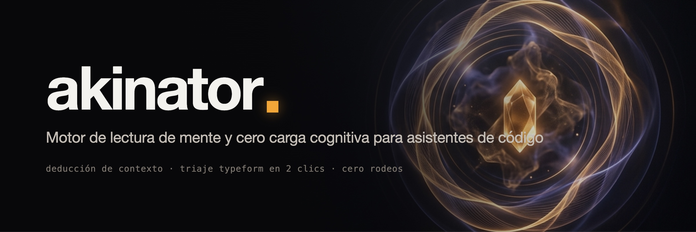

<div align="center">



Deja de pelear con la parálisis del prompt. Cuando estés cansado, saturado o no tengas ganas de escribir ("hueva"), Akinator lee el contexto de tu repositorio, hace preguntas de un solo toque, convierte ideas vagas en specs completos vía negativa, y ejecuta de inmediato.

[](LICENSE)
[](https://code.claude.com/docs)
[](https://antigravity.google)
[](#)

[English](README.md) · Español · [中文](README.zh-CN.md)

</div>

---

## El problema

Todo desarrollador conoce ese estado de **fatiga cognitiva** — coloquialmente conocido como *"tener hueva"*: te sientas frente a la terminal tras horas de context switching, sabes que hay trabajo pendiente, pero redactar un prompt de 500 palabras explicando el estado del proyecto se siente imposible.

Cuando le das a un asistente de IA estándar un comando vago como *"¿qué hago ahora?"* o *"continúa"*, suelen ocurrir dos desastres:
1. **La trampa del interrogatorio:** El modelo responde con una lista abrumadora de 10 puntos y 5 preguntas abiertas.
2. **La alucinación desorientada:** El modelo se engancha con archivos temporales o logs en caché y empieza a editar código irrelevante.

**Akinator resuelve esto mediante dos modos de profundidad: Siguiente Paso y Modo Spec.**

---

## Dos modos de operación

### 1. Siguiente Paso (Dentro de un repositorio existente)
Para cuando ya hay código o tareas en progreso:
- **Escaneo silencioso (<1 min):** Lee `git status -s`, `git log -5`, diffs sin commitear y archivos de pendientes (`TODO.md`, `ROADMAP.md`). Descarta automáticamente ruido de build, dependencias y caches.
- **Hipótesis concretas sin rodeos:** Si el contexto apunta a algo claro (un test que truena, trabajo a medias), se salta las preguntas y ofrece 3 opciones concretas con archivo y línea, la más probable primero, más "ninguna".
- **Pregunta de energía si el repo está limpio:** Si no hay nada a medias, hace una sola ronda de dos preguntas fáciles:
  - *"¿Con cuánta pila vienes?"* (poca / media / mucha → fix de 15 min / feature chica / algo profundo).
  - *"¿Qué se te antoja?"* (algo que se vea / algo por dentro / ordenar y limpiar).
- **Ejecución inmediata:** Eliges una opción y Akinator empieza a programar al instante, sin pedir confirmaciones ni rodeos.

### 2. Modo Spec (Para una idea vaga desde cero)
Para cuando quieres construir algo nuevo pero no sabes exactamente qué:
- **Vía negativa primero:** Pregunta qué tachar o descartar antes de definir qué meter. ¿Qué te chocaría más? ¿Qué NO debe llevar?
- **Tarjetas de un toque con letras corridas:** Las opciones usan letras continuas en toda la tarjeta (`a–c`, `d–f`, `g–i`, `j–l`), permitiendo responder en una sola línea (ej. `b f i j`) sin ambigüedad posicional.
- **Metáforas que se traducen a decisiones:** *"Si fuera comida: taco de esquina, comida corrida o menú degustación"*. Cada metáfora se traduce directamente a reglas de diseño (ej. taco de esquina = rápido, sin adornos, directo a producción).
- **Reflejo de terapeuta:** Tras cada ronda, resume lo que entendió en una sola línea con barra de progreso para que corrijas si algo se desvió.
- **Spec entregado con la adivinanza:** Entrega la hipótesis final acompañada de una especificación ejecutable completa en `specs/<slug>.md`:
  - **Lo que sí** y **Lo que NO** (descartes explícitos)
  - **Cómo se siente** (tono, densidad y ritmo)
  - **Criterios de aceptación observables** (`[ ]`)
  - **Riesgos y supuestos**
  - **Primer paso concreto**

---

## 🎨 La experiencia de un toque

Las preguntas llegan en tarjetas limpias que se responden con letras en una sola línea:

```
akinator ▪ ronda 1 de 2

1. ¿Quién lo va a usar más?     a) tú   b) tus clientes   c) tu equipo
2. Amaneces y ya existe. ¿Qué notas primero?
   d) ya no pierdes la tarde en eso   e) te llegan más pedidos   f) todos saben qué toca
3. ¿Qué te chocaría más?        g) que sea lento   h) que se vea feo   i) que sea complicado
4. Si fuera comida…             j) taco de esquina   k) comida corrida   l) menú degustación

Contesta con letras en una línea, p. ej. «b f i j» · ok = lo que yo elegiría · ? = me da igual · ya = adivina
Sin respuestas malas; «ya» para cortar cuando quieras.
```

Akinator refleja en una línea lo entendido:

```
▰▰▱▱ Va: para tu equipo, que se use desde el cel, rápido y sin adornos (taco de esquina), sin cuentas.
```

Y revela la adivinanza final junto con el spec:

```
> Creo que estás pensando en… TeamRun: una tarjeta web ligera para celular fijada en tu chat grupal. Muestra la ruta del sábado, la hora de salida y confirmación de asistencia con primer nombre para el café posterior. Sin cuentas, sin Strava, sin cobros. El spec ya está en specs/team-run.md.

a) Sí, arranca · b) Sí, solo el spec · c) Casi · d) Frío
```

---

## Comparativa

| Dimensión | Akinator v2 | Asistente Estándar | Prompting Manual |
|---|---|---|---|
| **Carga cognitiva** | **Cero (una línea de letras o un clic)** | Alta (leer parrafadas y preguntas abiertas) | Máxima (redactar 500 palabras) |
| **Fricción de respuesta** | Letras simples (`a d g j` u `ok`) | Múltiples párrafos de ida y vuelta | Redacción exhaustiva |
| **Desambiguación** | Letras corridas (`a–c`, `d–f`...) | Conjeturas posicionales propensas a error | Reiteración manual |
| **Calidad de entrega** | Spec ejecutable con descartes y riesgos | Ideas sueltas y planes a medias | Dependiente del prompt inicial |
| **Gatillo de ejecución** | **Inmediato al confirmar** | Requiere rondas adicionales de validación | Requiere prompts de seguimiento |

---

## Instalación

### Método 1: Plugin para Claude Code (Recomendado)

```
/plugin marketplace add obeskay/akinator
```
```
/plugin install akinator@akinator
```

> [!NOTE]
> Envía ambos comandos como dos prompts separados. Abre una sesión nueva después de instalar para que Claude cargue el plugin.

---

### Método 2: Instalación directa de Skill (Claude Code, Antigravity, Codex)

Dado que la skill vive en `skills/akinator/` dentro del repositorio, clona el proyecto en tu carpeta de herramientas y crea el symlink correspondiente:

```bash
# 1. Clonar el repositorio
git clone https://github.com/obeskay/akinator.git ~/tools/akinator

# 2. Crear symlink en tu directorio de skills:
# Para Claude Code:
mkdir -p ~/.claude/skills && ln -s ~/tools/akinator/skills/akinator ~/.claude/skills/akinator

# Para Antigravity (AGY):
mkdir -p ~/.gemini/config/skills && ln -s ~/tools/akinator/skills/akinator ~/.gemini/config/skills/akinator

# Para Codex / Entornos de agentes:
mkdir -p .agents/skills && cp -r ~/tools/akinator/skills/akinator .agents/skills/
```

**Comando rápido en una sola línea (Copia directa):**
```bash
git clone --depth 1 https://github.com/obeskay/akinator.git /tmp/akinator && \
  mkdir -p ~/.claude/skills && cp -r /tmp/akinator/skills/akinator ~/.claude/skills/ && \
  rm -rf /tmp/akinator
```

---

## Triggers y Uso

Escribe con total naturalidad cuando no tengas ganas de redactar:

```
tengo hueva
```
```
léeme la mente
```
```
no sé qué hacer, dime qué sigue
```
```
quiero hacer algo pero no sé qué, pregúntame
```
```
/akinator
```

---

## Licencia

[MIT](LICENSE) © [obeskay](https://github.com/obeskay)
