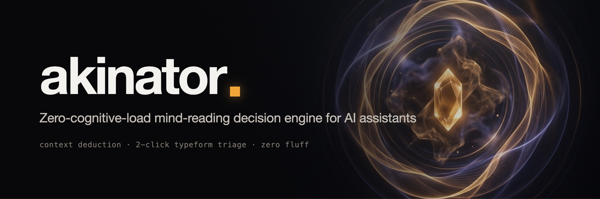

<div align="center">



Stop fighting prompt paralysis. When you are tired, overwhelmed, or have zero energy to type, Akinator reads your codebase context, asks ultra-easy one-tap questions, turns fuzzy ideas into clean specs via negativa, and executes immediately.

[](LICENSE)
[](https://code.claude.com/docs)
[](https://antigravity.google)
[](#)

English · [Español](README.es.md) · [中文](README.zh-CN.md)

</div>

---

## The Problem

Every developer knows the state of **cognitive exhaustion** — in Spanish, *"tener hueva"*: you sit down at the terminal after hours of context switching, you know work needs to be done, but formulating a 500-word prompt explaining the current state feels impossible.

When you give a standard AI assistant a vague prompt like *"what should I do?"* or *"continue"*, two bad things usually happen:
1. **The Interrogation Trap:** The model responds with an overwhelming 10-point numbered list and asks you 5 open-ended questions.
2. **The Hallucination Guess:** The model latches onto temporary files or cached logs and starts fixing irrelevant code.

**Akinator solves this with two specialized depths: Next-Step Depth and Spec Depth.**

---

## Two Operating Modes

### 1. Next-Step Depth (Inside a Repo)
When you have an existing codebase or work in progress:
- **Quiet context scan (<1 min):** Reads `git status -s`, `git log -5`, uncommitted diffs, and project trackers (`TODO.md`, `ROADMAP.md`). Drops all cache, build, and temporary noise.
- **Immediate concrete hypotheses:** If context points somewhere (a failing test, uncommitted WIP), it skips questions and offers 3 concrete guesses with exact file citations, most likely first, plus "none".
- **Zero-context battery check:** If the repo has no WIP, it asks one round of 2 easy questions:
  - *"How much energy do you have?"* (low / medium / high → 15-min fix / small feature / deep task).
  - *"What are you in the mood for?"* (something visible / under the hood / clean and organize).
- **Instant execution:** Once you tap an option, Akinator executes immediately without confirmations or preamble.

### 2. Spec Depth (From a Fuzzy Idea)
When you want to build something new but don't know where to start:
- **Via Negativa First:** Asks what to discard or strike before defining what to build. What would annoy you most? What is out of scope?
- **One-Tap Running-Letter Cards:** Questions never require open-ended text. Options use continuous letters across questions (`a–c`, `d–f`, `g–i`, `j–l`) so a reply like `b f i j` is parsed with 100% precision.
- **Everyday Metaphors translated into Rules:** *"If it were food: street taco, lunch special, or tasting menu?"* Every metaphor translates directly into concrete design rules (e.g. street taco = scrappy, fast, zero fluff).
- **Therapist Reflection:** After each round, reflects back what it understood in a single line with a progress bar.
- **Spec Delivered with the Guess:** Delivers the guess alongside a complete, buildable specification (`specs/<slug>.md`) covering:
  - **What's in (Lo que sí)** & **What's out (Lo que NO)**
  - **Feel & Tone**
  - **Observable Acceptance Criteria** (`[ ]`)
  - **Risks & Assumptions**
  - **First actionable step**

---

## 🎨 The One-Tap Experience

Questions arrive in a clean card answered with single letters on one line:

```
akinator ▪ round 1 of 2

1. Who uses it most?            a) you   b) your clients   c) your team
2. You wake up and it exists. What do you notice first?
   d) you get your afternoon back   e) more orders come in   f) everyone knows what to do
3. What would bug you most?     g) too slow   h) looks ugly   i) too complicated
4. If it were food…             j) street taco   k) lunch special   l) tasting menu

Answer with letters on one line, e.g. "b f i j" · ok = my recommendation · ? = don't care · go = just guess
No wrong answers; "go" stops questions and guesses immediately.
```

After your reply, Akinator reflects back what it heard and continues:

```
▰▰▱▱ Got it: for your team, mobile-first, fast and zero fluff (street taco), no accounts.
```

And reveals the final guess with the full spec:

```
> I think you're thinking of… TeamRun: a lightweight mobile web card pinned in your group chat. Shows Saturday's route, start time, and a one-tap first-name RSVP so you have an accurate headcount. No accounts, no Strava, no fees. The spec is ready in specs/team-run.md.

a) Yes, start building · b) Yes, just the spec · c) Close · d) Cold
```

---

## Comparison

| Dimension | Akinator v2 | Vanilla Assistant | Manual Prompting |
|---|---|---|---|
| **Cognitive Effort** | **Zero (one line of letters)** | High (reading essays & open questions) | Maximum (writing 500-word prompts) |
| **Response Friction** | Single letters (`a d g j` or `ok`) | Multi-paragraph back-and-forth | Long prompt formulation |
| **Disambiguation** | Continuous letters (`a–c`, `d–f`...) | Positional guesswork | Manual reiteration |
| **Output Quality** | Complete spec with non-goals & risks | Vague suggestions | Dependent on prompt quality |
| **Execution Trigger** | **Immediate upon confirmation** | Requires extra rounds of verification | Requires follow-up prompts |

---

## Installation

### Method 1: Claude Code Plugin (Recommended)

```
/plugin marketplace add obeskay/akinator
```
```
/plugin install akinator@akinator
```

> [!NOTE]
> Send these as two separate prompts. Start a fresh session after installation to load the plugin.

---

### Method 2: Direct Skill Installation (Claude Code, Antigravity, Codex)

Because the skill lives in `skills/akinator/` inside the repository, clone it to your tools directory and create a symlink:

```bash
# 1. Clone repo
git clone https://github.com/obeskay/akinator.git ~/tools/akinator

# 2. Symlink to your assistant's skill directory:
# For Claude Code:
mkdir -p ~/.claude/skills && ln -s ~/tools/akinator/skills/akinator ~/.claude/skills/akinator

# For Antigravity (AGY):
mkdir -p ~/.gemini/config/skills && ln -s ~/tools/akinator/skills/akinator ~/.gemini/config/skills/akinator

# For Codex / Agent environments:
mkdir -p .agents/skills && cp -r ~/tools/akinator/skills/akinator .agents/skills/
```

**Single-Command One-Liner (Copy):**
```bash
git clone --depth 1 https://github.com/obeskay/akinator.git /tmp/akinator && \
  mkdir -p ~/.claude/skills && cp -r /tmp/akinator/skills/akinator ~/.claude/skills/ && \
  rm -rf /tmp/akinator
```

---

## Triggers & Usage

Speak naturally when you don't feel like typing:

```
tengo hueva
```
```
léeme la mente
```
```
what should I work on next?
```
```
i want to build something but not sure what, ask me questions
```
```
/akinator
```

---

## License

[MIT](LICENSE) © [obeskay](https://github.com/obeskay)
