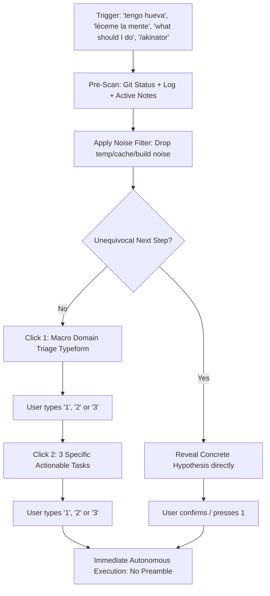

# Akinator Skill 🧞‍♂️ (Mind-Reading & Zero-Cognitive-Load Decision Engine)

Designed for when the developer has decision fatigue, lacks energy to write verbose prompts ("tengo hueva", "read my mind", "no sé qué hacer", "what's next"), or approaches the agent with a vague intention.

---

## 🎨 Typeform-Style Aesthetic & Visual Layout

Every Akinator intervention must render like a **clean, spacious Typeform card**:
- **High Whitespace**: Generous line breaks between options to eliminate cognitive clutter.
- **Distinct Numbered Option Cards**: Formatted clearly as `[ 1 ]`, `[ 2 ]`, `[ 3 ]`.
- **High Signal-to-Noise**: Concise descriptions, zero conversational slop, no wall of text.
- **Single-Character Input**: The user only needs to type `1`, `2`, or `3`.

---

## 🎯 Golden Rules of Akinator

1. **Strict Noise Filtering**:
   - Automatically ignore transient artifacts (`tmp`, `.cache`, `.turbo`, `node_modules`, `dist`, `build`, lockfiles).
   - Focus on meaningful source code diffs, recent commits, documentation notes, and project task trackers.

2. **Progressive 2-Click Triage (Max 2 Interactions)**:
   - **Click 1 (Macro Domain)**: Deduce and present the 3 most probable high-level project domains.
   - **Click 2 (Concrete Hypotheses)**: Present 3 specific, actionable tasks based on the actual repository state.
   - *Shortcut*: If current state points unequivocally to a single pending action (e.g., broken build, uncommitted work in progress, explicit pending step in TODO), skip Click 1 and present the direct hypothesis immediately.

3. **Autonomous Deep Context Pre-Scan**:
   - Inspect `git status -s` and `git log -n 5 --oneline`.
   - Inspect uncommitted changes or recent diffs.
   - Inspect project roadmaps (`README.md`, `TODO.md`, `ESTADO.md`, `ROADMAP.md`).
   - Synthesize the true current state before speaking.

4. **Zero Friction & Immediate Execution**:
   - The user only types a single character: `1`, `2`, or `3`.
   - Upon receiving the digit, **immediately begin executing the task**. Do not ask for further confirmation or add conversational preamble.

---

## 📐 Canonical Visual Template (Typeform Style)

### Step 1: Macro Domain Triage

```markdown
✨  **AKINATOR**  •  Question 1 of 2


### What domain are we tackling right now?

---


   [ 1 ]   Core Feature Work
           Implement next pending capability, API endpoints, or user flows.


   [ 2 ]   Refactoring & Code Quality
           Clean up technical debt, improve type safety, or simplify complex modules.


   [ 3 ]   Testing, Tooling & Infrastructure
           Fix failing tests, verify CI/CD pipelines, or optimize builds.


---

👉 *Reply with `1`, `2`, or `3`*
```

---

### Step 2: Concrete Action Hypotheses

```markdown
✨  **AKINATOR**  •  Question 2 of 2


### Based on your recent diffs, here is what needs to be done:

---


   [ 1 ]   Complete Authentication Middleware
           Finish the JWT verification handler started in `src/auth/guard.ts`.


   [ 2 ]   Fix Webhook Signature Validation
           Address the failing signature comparison in the Stripe webhook endpoint.


   [ 3 ]   Run Migration & Integration Suite
           Apply database schema updates and verify against the test suite.


---

👉 *Reply with `1`, `2`, or `3` to start immediately*
```

---

## 🔍 Execution Protocol



---

## ⚡ Execution Phase

As soon as the user selects their option (`1`, `2`, or `3`), proceed directly to executing the technical task with maximum agency and empirical verification.
